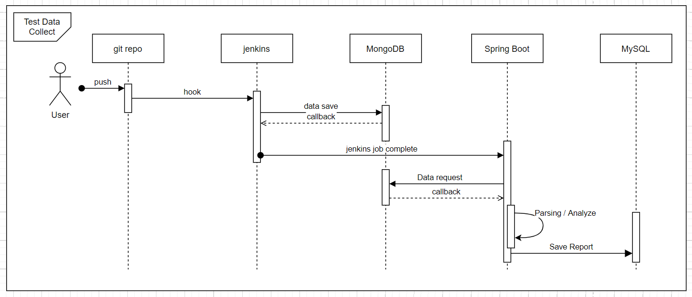
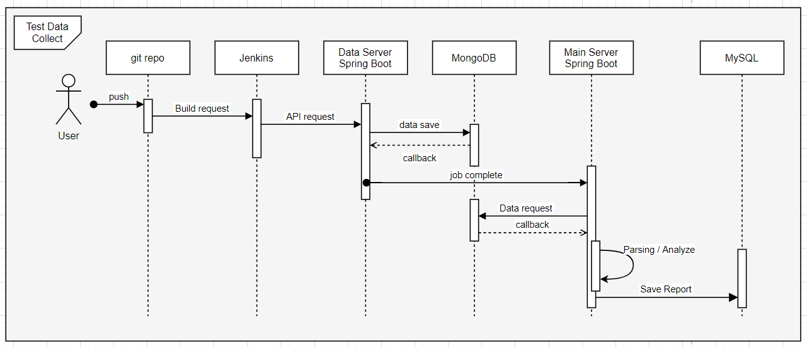

# TMI ( Test automation Management Infrastucture )

## SSAFY X SAMSUNG SDS (기업연계 프로젝트 )

## 프로젝트 개요

- **진행기간** : 2021.04.12 ~ (ing)
- **만든이** : 강세준, 김영록, 백현오, 이병희, 전원표, 최낙훈
- **기획 배경** : 
  - 테스트 자동화란, 테스트 과정 일부 또는 전체를 수작업이 아닌 자동화된 프로그램을 통해서 수행하는 기법
  - 현업에서는 이런 테스트 자동화를 거치고 난 후에 배포가 이뤄짐

## Document

    
 Wireframe

    <ul>

    </ul>

    
 Architecture 

    <ul>

    </ul>

    
 Sequence Diagram 

    <ul>

        

    </ul>

    
 Milestone

    <ul>

    </ul>

